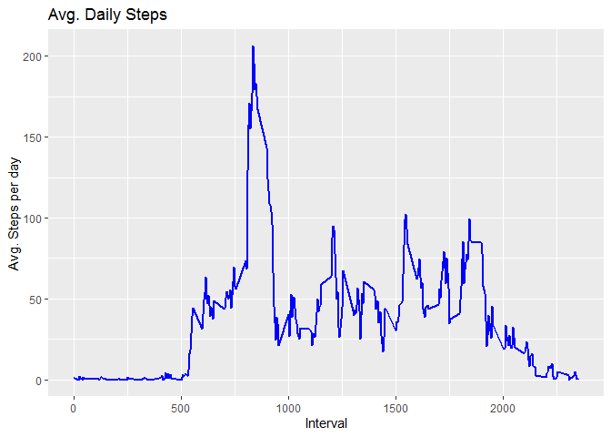
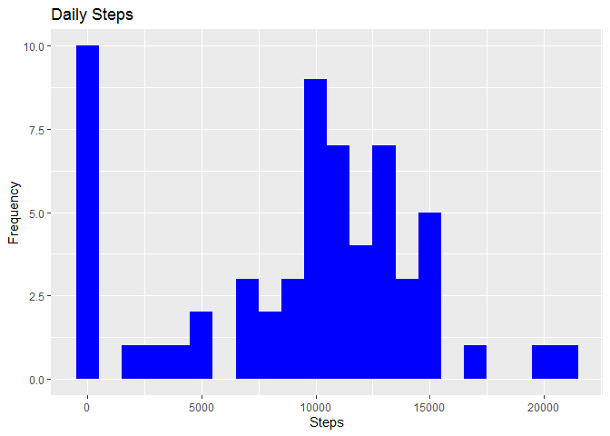

## Loading and preprocessing the data

    setwd("C:/Users/John/Desktop/repData")
    library(knitr)
    library(rmarkdown)
    library("data.table")
    library(ggplot2)
    library(DescTools)

    ## Warning: package 'DescTools' was built under R version 4.0.5

    ## 
    ## Attaching package: 'DescTools'

    ## The following object is masked from 'package:data.table':
    ## 
    ##     %like%

    library(png)

## Reading csv Data into Data.Table.

    activityDT <- data.table::fread(input = "activity.csv")

## What is mean total number of steps taken per day?

    ##           date steps
    ##  1: 2012-10-01    NA
    ##  2: 2012-10-02   126
    ##  3: 2012-10-03 11352
    ##  4: 2012-10-04 12116
    ##  5: 2012-10-05 13294
    ##  6: 2012-10-06 15420
    ##  7: 2012-10-07 11015
    ##  8: 2012-10-08    NA
    ##  9: 2012-10-09 12811
    ## 10: 2012-10-10  9900

    ## Warning: Removed 8 rows containing non-finite values (stat_bin).

## What is the average daily activity pattern?

    ##    max_interval
    ## 1:          835

## Imputing missing values

    ## [1] 2304

    ## [1] 2304

<table>
<thead>
<tr class="header">
<th>Type of Estimate</th>
<th>Mean_Steps</th>
<th>Median_Steps</th>
</tr>
</thead>
<tbody>
<tr class="odd">
<td>First Part (with na)</td>
<td>10765</td>
<td>10765</td>
</tr>
<tr class="even">
<td>Second Part (fillin in na with median)</td>
<td>9354.23</td>
<td>10395</td>
</tr>
</tbody>
</table>

## Are there differences in activity patterns between weekdays and weekends?

