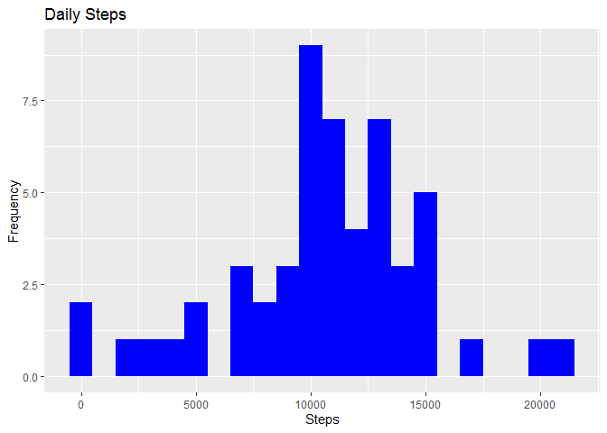
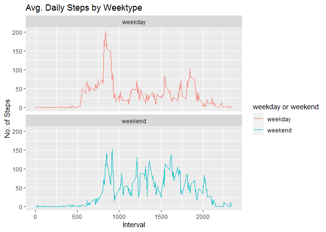

## Loading and preprocessing the data

    ## Warning: package 'DescTools' was built under R version 4.0.5

    ## 
    ## Attaching package: 'DescTools'

    ## The following object is masked from 'package:data.table':
    ## 
    ##     %like%

## Reading csv Data into Data.Table.

## What is mean total number of steps taken per day?

1.  Calculate the total number of steps taken per day

<!-- -->

    ##           date steps
    ##  1: 2012-10-01    NA
    ##  2: 2012-10-02   126
    ##  3: 2012-10-03 11352
    ##  4: 2012-10-04 12116
    ##  5: 2012-10-05 13294
    ##  6: 2012-10-06 15420
    ##  7: 2012-10-07 11015
    ##  8: 2012-10-08    NA
    ##  9: 2012-10-09 12811
    ## 10: 2012-10-10  9900

1.  If you do not understand the difference between a histogram and a
    barplot, research the difference between them. Make a histogram of
    the total number of steps taken each day.

<!-- -->

    ggplot(Total_Steps, aes(x = steps)) +
        geom_histogram(fill = "blue", binwidth = 1000) +
        labs(title = "Daily Steps", x = "Steps", y = "Frequency")

    ## Warning: Removed 8 rows containing non-finite values (stat_bin).

1.  Calculate and report the mean and median of the total number of
    steps taken per day

<!-- -->

    ##    Mean_Steps Median_Steps
    ## 1:   10766.19        10765

## What is the average daily activity pattern?

1.  Make a time series plot (i.e. 𝚝𝚢𝚙𝚎 = “𝚕”) of the 5-minute interval
    (x-axis) and the average number of steps taken, averaged across all
    days (y-axis)

1.  Which 5-minute interval, on average across all the days in the
    dataset, contains the maximum number of steps?

<!-- -->

    ##    max_interval
    ## 1:          835

## Imputing missing values

1.  Calculate and report the total number of missing values in the
    dataset (i.e. the total number of rows with 𝙽𝙰s)

<!-- -->

    ## [1] 2304

    ## [1] 2304

1.  Devise a strategy for filling in all of the missing values in the
    dataset. The strategy does not need to be sophisticated. For
    example, you could use the mean/median for that day, or the mean for
    that 5-minute interval, etc.

2.  Create a new dataset that is equal to the original dataset but with
    the missing data filled in.

3.  Make a histogram of the total number of steps taken each day and
    calculate and report the mean and median total number of steps taken
    per day. Do these values differ from the estimates from the first
    part of the assignment? What is the impact of imputing missing data
    on the estimates of the total daily number of steps?

<!-- -->

    ##    Mean_Steps Median_Steps
    ## 1:    9354.23        10395

<table>
<thead>
<tr class="header">
<th>Type of Estimate</th>
<th>Mean_Steps</th>
<th>Median_Steps</th>
</tr>
</thead>
<tbody>
<tr class="odd">
<td>First Part (with na)</td>
<td>10765</td>
<td>10765</td>
</tr>
<tr class="even">
<td>Second Part (fillin in na with median)</td>
<td>9354.23</td>
<td>10395</td>
</tr>
</tbody>
</table>

## Are there differences in activity patterns between weekdays and weekends?

1.  Create a new factor variable in the dataset with two levels –
    “weekday” and “weekend” indicating whether a given date is a weekday
    or weekend day.

<!-- -->

    ##     steps       date interval Day of Week weekday or weekend
    ##  1:    NA 2012-10-01        0      Monday            weekday
    ##  2:    NA 2012-10-01        5      Monday            weekday
    ##  3:    NA 2012-10-01       10      Monday            weekday
    ##  4:    NA 2012-10-01       15      Monday            weekday
    ##  5:    NA 2012-10-01       20      Monday            weekday
    ##  6:    NA 2012-10-01       25      Monday            weekday
    ##  7:    NA 2012-10-01       30      Monday            weekday
    ##  8:    NA 2012-10-01       35      Monday            weekday
    ##  9:    NA 2012-10-01       40      Monday            weekday
    ## 10:    NA 2012-10-01       45      Monday            weekday

1.  Make a panel plot containing a time series plot (i.e. 𝚝𝚢𝚙𝚎 = “𝚕”) of
    the 5-minute interval (x-axis) and the average number of steps
    taken, averaged across all weekday days or weekend days (y-axis).
    See the README file in the GitHub repository to see an example of
    what this plot should look like using simulated data.

